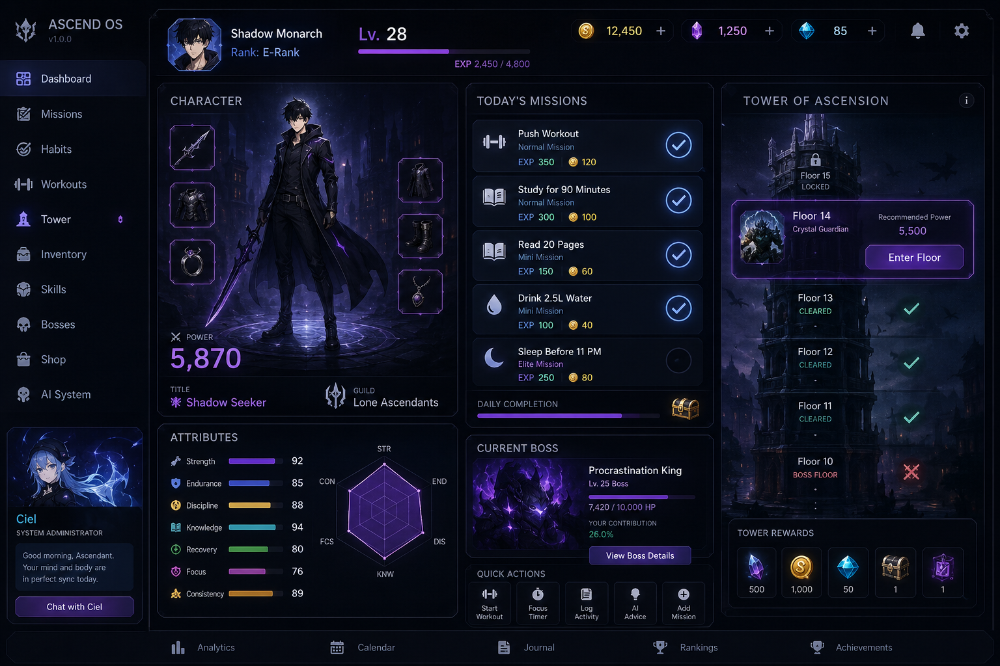
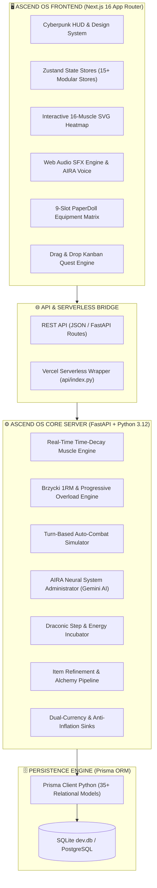

<div align="center">

# 🌌 ASCEND OS
### The Next-Generation Gamified Self-Mastery & Physical Evolution Operating System

[](https://nextjs.org/)
[](https://react.dev/)
[](https://www.typescriptlang.org/)
[](https://tailwindcss.com/)
[](https://fastapi.tiangolo.com/)
[](https://python.org/)
[](https://prisma.io/)
[](https://sqlite.org/)
[](https://opensource.org/licenses/MIT)

<p align="center">
  <em>Transform real-world workouts, habit streaks, cognitive deep work, and discipline into a tactical progression RPG. Ascend OS bridges real-world effort (The Reality Layer) with a deep simulated game world (The RPG Layer) to eradicate burnout, overcome the 30-day retention cliff, and turn daily mastery into an epic solo ascension.</em>
</p>

[Key Features](#-core-subsystems--feature-breakdown) • [System Architecture](#-system-architecture) • [Directory Map](#-repository-structure) • [Quick Start](#-quick-start--local-development) • [Environment Config](#-environment-variables) • [Deployment](#-production-deployment)

---

</div>

## 📸 Visual Showcase & HUD Previews

<div align="center">

| 🩻 Interactive Anatomical Recovery Heatmap | 🧙 PaperDoll Equipment & RPG Inventory |
| :---: | :---: |
|  | *`[PaperDoll & 9-Slot Gear Grid Placeholder]`*<br>*(Live SVG 9-slot equipment layout with real-time stat bonuses)* |

| 🐉 Beast Incubation & 20-Dragon Bestiary | ⚔️ Tower of Ascension & Boss Arena |
| :---: | :---: |
| *`[Dragon Incubation & Bestiary GIF Placeholder]`*<br>*(20 animated elemental dragons with step synchronization)* | *`[Boss Combat Arena GIF Placeholder]`*<br>*(Turn-based combat simulation against 20 floors & epic goal bosses)* |

| 🎯 Kanban Quests & Habit Strength Heatmap | 🧠 Deep Work Focus & Sleep Telemetry |
| :---: | :---: |
| *`[Kanban Quest Board Placeholder]`*<br>*(3-Tier Mini/Normal/Elite mission sizing & habit continuity)* | *`[Sleep & Focus HUD Placeholder]`*<br>*(Binaural ambient sounds, Pomodoro timer, & sleep recovery curve)* |

</div>

---

## 🌟 Core Philosophy: The Reality vs. RPG Divide

Standard fitness and habit tracking apps suffer from an industry-wide **Day-30 retention cliff** (sub-4% retention) driven by **loss aversion**, **binary streak resets**, and the **"What-the-Hell" psychological effect**. A single missed day often resets a streak to zero, destroying intrinsic motivation.

**Ascend OS completely solves this through architectural separation:**
1. **The Reality Layer (Real Life):** Real-world habits, heavy compound gym sessions, deep work blocks, and sleep hygiene are purely the **training grounds** that generate attributes.
2. **The RPG Layer (The Tower & Gauntlets):** The simulated game where your earned stats are put to the test. You never defeat a monster by simply checking a box; you conquer dungeons using the tangible power earned from your real-world discipline.
3. **Algorithmic Mathematical Forgiveness:** Replaces fragile binary streak counters with an **asymptotic continuous habit strength curve** ($S_t \in [0.0, 1.0]$) and automated **Streak Freeze Shields**, preventing total momentum loss on missed days.

---

## ⚡ System Architecture



---

## 🧰 Tech Stack Breakdown

### Frontend Ecosystem
- **Framework:** [Next.js 16 (App Router)](https://nextjs.org/) with React 19 (`client/src/app`)
- **Language:** TypeScript 5.0+ with strict typing
- **Styling & HUD:** [Tailwind CSS v4](https://tailwindcss.com/) + PostCSS + CSS Variables for dynamic cyberpunk themes
- **Animations:** [Framer Motion 12](https://www.framer.com/motion/) (orchestrated stagger animations, modal springs, combat shakes)
- **State Management:** [Zustand 5](https://github.com/pmndrs/zustand) (15+ discrete domain stores with optimistic updates)
- **UI Component Primitives:** [Radix UI](https://www.radix-ui.com/) & Base UI (Dialog, Dropdown, Popover, Tabs, Avatar)
- **Data Visualizations:** [Recharts](https://recharts.org/) (Radar attribute charts, Weekly EXP graphs, Sleep efficiency curves)
- **Interactive Heatmaps:** Custom multi-layer SVG Anatomical Muscle Heatmap + `react-calendar-heatmap`
- **Audio & FX:** Native Web Audio API + HTML5 Audio SFX (`useSystemAudio.ts`) + `canvas-confetti`

### Backend Ecosystem
- **Framework:** [FastAPI](https://fastapi.tiangolo.com/) (High-performance Python 3.12+ async REST API)
- **Server Engine:** [Uvicorn](https://www.uvicorn.org/) ASGI with custom lifespan database connection pools
- **ORM & Data Layer:** [Prisma Client Python](https://prisma-client-py.readthedocs.io/) with SQLite (`dev.db`) or PostgreSQL
- **Data Validation:** [Pydantic v2](https://docs.pydantic.dev/) schemas with strict runtime type casting
- **AI Intelligence:** [Google Generative AI (Gemini)](https://ai.google.dev/) for AIRA clinical system coaching & tool calling
- **Authentication & Security:** Passwords hashed with bcrypt, JWT token validation, rate-limited email verification OTPs via [Resend](https://resend.com/)
- **Recurrence & Math:** `rrule` recurrence rule parsing, Brzycki 1RM formula, continuous exponential habit decay

---

## 🎮 Core Subsystems & Feature Breakdown

### 1. 🩻 Fitness, Anatomical Heatmap & Real-Time Recovery Engine
*Codebase: `client/src/features/fitness/`, `client/src/components/workout/`, `server/routers/workouts.py`, `server/services/fitness_engine.py`*

- **Interactive Vector Anatomical Silhouette:** Multi-layer SVG covering 16 canonical muscle groups across anterior (front) and posterior (back) views (`CHEST`, `FRONT_DELTS`, `SHOULDERS`, `REAR_DELTS`, `TRAPS`, `LATS`, `LOWER_BACK`, `BICEPS`, `TRICEPS`, `FOREARMS`, `ABS`, `OBLIQUES`, `QUADS`, `HAMSTRINGS`, `GLUTES`, `CALVES`).
- **Dynamic Time-Decay Math (Zero Cron Dependency):** Muscle recovery is computed in real-time on fetch using UTC timestamps against muscle-specific recovery durations (48h standard, 72h heavy compounds like Lats, Quads, Glutes).
- **Color-Coded Readiness Telemetry:**
  - `80%–100%`: Neon Cyan (Optimal Readiness)
  - `40%–79%`: Electric Amber (Active Regeneration)
  - `0%–39%`: Crimson / Neon Red (Heavy Fatigue)
- **Brzycki Estimated 1-Rep Max (1RM) Engine:**
  $$\text{1RM} = \frac{\text{Weight}}{1.0278 - (0.0278 \times \text{Reps})}$$
- **Automated Progressive Overload Recommendations:** Evaluates the last 10 session logs; cleanly hitting $\ge 8$ reps automatically recommends $+2.5\text{ kg}$ weight increase for the next session.
- **Natural Language & Voice Parser:** Parses raw voice or text entries (e.g., *"Bench press 80kg for 5 reps rpe 8"*) using regex token matching.
- **Real-Time Rest Countdown:** Integrated visual timer (30s, 60s, 90s, 120s, custom) with audio chimes.
- **PR Breakthrough Celebrations:** Animated confetti modals upon breaking personal records.

---

### 2. 🐉 Gamification, Beast Egg Incubation & Animated Dragon Bestiary
*Codebase: `client/src/features/beasts/`, `server/routers/beasts.py`, `server/prisma/schema.prisma`*

- **Physical Step & Energy Incubation:** Real-world walking steps and workout calories directly charge incubating dragon eggs (`targetSteps`, `targetEnergy`).
- **20 Animated Dragon Species:** Complete catalog of unique dragons (`beast_1.gif` through `beast_20.gif`) with rich lore, behavioral biology, and tactical combat synergy.
- **Elemental Affinities:** 7 distinct elements (`VOID`, `NATURE`, `FROST`, `FIRE`, `CYBER`, `HOLY`, `STORM`).
- **Rarity Hierarchy:** `COMMON` $\rightarrow$ `RARE` $\rightarrow$ `EPIC` $\rightarrow$ `LEGENDARY` $\rightarrow$ `HOLOGRAPHIC`.
- **Passive Attribute Multipliers:** Equipping a dragon applies passive modifiers to EXP, Gold, Strength, Knowledge, Agility, Focus, and Recovery.
- **Dragon Training & Beast Leveling:** Feed accumulated steps and gold to level up your companion and scale its passive buffs.
- **Mystery Egg Shop & Hatching Sequences:** Buy eggs from the store and unlock them via full-screen celebration modals.

---

### 3. ⚔️ Combat, Tower of Ascension & Sequential Boss Gauntlet
*Codebase: `client/src/features/tower/`, `client/src/features/bosses/`, `server/routers/tower.py`, `server/services/combat_engine.py`*

- **20-Floor Tower Gauntlet:** Themed dungeon sectors (Iron Citadel, Sunken Archive, Void Monolith) testing distinct attribute thresholds.
- **Turn-Based Auto-Combat Simulator:**
  - **Player HP:** $HP_{max} = (\text{Endurance} \times 12) + (\text{Discipline} \times 5)$
  - **Physical Damage:** $DMG_{Phys} = \max(1, (\text{Strength} \times 1.5) - \text{Enemy Defense})$
  - **Magical Damage:** $DMG_{Mag} = \max(1, (\text{Knowledge} \times 1.4) - \text{Enemy Resistance})$
  - **Critical Hits:** Chance scaled via $(\text{Focus} \times 0.05\%)$ for a $\times 2.0$ damage multiplier.
  - **Round Healing:** End-of-turn recovery $HP_{rec} = \text{Recovery} \times 0.8$.
- **Floor Boss Encounters:** Bosses every 5 floors (`Golux`, `Arcane Wizard`, `Necromancer`, `NightBorne`) with custom sprites and element weaknesses.
- **Epic Goal "Reality Raids":** Transforms multi-month real-world milestones (e.g., *"Finish Master's Thesis"*, *"Run Half-Marathon"*, *"Pay Off Debt"*) into massive multi-phase raid bosses with HP bars chipped away by completing real-world tasks.

---

### 4. 🧙 RPG Character Identity, Stats, PaperDoll & Specializations
*Codebase: `client/src/features/character/`, `client/src/features/inventory/`, `client/src/features/skills/`, `server/routers/character.py`*

- **7 Core RPG Attributes:**
  - 🔴 **Strength (STR):** Tower physical damage, gym overload power.
  - 🔵 **Knowledge (KNW):** Magic damage, cognitive learning speed.
  - 🟢 **Recovery (REC):** Turn HP regeneration, sleep hygiene & muscle recovery.
  - 🛡️ **Discipline (DIS):** Damage mitigation, habit streak preservation.
  - 💛 **Endurance (END):** Max HP pool, cardio stamina.
  - 🟣 **Focus (FCS):** Critical hit rate, Pomodoro deep work duration.
  - ⚪ **Consistency (CON):** Rare loot drop rates, crafting shard yield.
- **Polynomial Leveling Curve:**
  $$\text{TotalXPForLevel}(L) = 100 \times (L - 1)^{1.5}$$
- **Power Score & Hunter Rank Promotion:** E-Rank (0–1,000) through SSS-Rank National Level (150,000+).
- **Interactive 9-Slot PaperDoll:** Visual gear grid (`HELMET`, `WEAPON`, `OFF_HAND`, `ARMOR`, `GLOVES`, `BOOTS`, `RING`, `NECKLACE`, `ARTIFACT`).
- **Class Specializations & Branching Skill Trees:** Unlock archetypes (Warrior, Mage, Assassin, Paladin, Shadow Monarch) and spend Skill Points (SP) to unlock Active, Passive, and Ultimate skills.
- **Equippable Titles:** Unlockable milestone titles providing percentage stat multipliers.

---

### 5. 🎯 Habit Mastery, Kanban Quests & Mathematical Forgiveness
*Codebase: `client/src/features/habits/`, `server/routers/habits.py`, `server/services/decay_service.py`*

- **Continuous Habit Strength Modeling:**
  $$S_t = S_{t-1} + C_t \cdot \alpha \cdot (1 - S_{t-1}) - (1 - C_t) \cdot (1 - \delta) \cdot S_{t-1}$$
  Preserves user progress during life disruptions instead of zeroing out weeks of effort.
- **3-Tier Sizing (Mini / Normal / Elite):** Every habit can be completed at a Mini baseline (low friction), Normal, or Elite tier with proportional EXP/Gold rewards.
- **Interactive Kanban Quest Board:** Organize daily missions across *Pending*, *In Progress*, and *Completed* columns with smooth drag-and-drop animations.
- **Streak Freeze Shields:** Consumable shields auto-activate upon missed days to preserve streaks.
- **GitHub-Style Habit Heatmap:** Full-year historical activity matrix visualizing habit density.

---

### 6. 🧠 AIRA Neural System Administrator & Conversational AI
*Codebase: `client/src/features/aira/`, `server/routers/aira.py`, `server/services/aira_service.py`*

- **Singular Unemotional AI Persona:** Modeled after "Raphael / Ciel" and Solo Leveling system voices; provides clinical, data-driven feedback without artificial emotional filler.
- **Context-Aware Analytics:** Analyzes user combat failures, workout plateaus, and schedule friction to deliver actionable optimizations.
- **Tool Calling & Mutative Actions:** AIRA can generate workouts, complete missions, and optimize habit routines directly on user confirmation.
- **Audio Feedback SFX:** Integrated system voice cues (`playNoticeSound`, `playConfirmedSound`, `playSkillSound`, `playEvolutionSound`).

---

### 7. 💎 Economy, Dual Currencies, Daily Boosts & Crafting Engine
*Codebase: `client/src/features/shop/`, `client/src/features/crafting/`, `server/routers/shop.py`, `server/routers/crafting.py`*

- **Dual-Currency Architecture:** Gold (soft currency for daily consumables and equipment) and Ascension Crystals / Gems (hard currency for rare cosmetics and artifact unlocks).
- **Anti-Inflation Dynamic Sinks:** Daily rotating shop with stock limits, repair fees, and refinement costs.
- **Blacksmith Crafting Registry:** Forging recipes for weapons, armor, and accessories requiring monster scales, shadow steel ingots, and gems.
- **Equipment Refinement & Salvaging:** Upgrade item tiers or dismantle unwanted gear into base refinement shards.
- **Daily & Weekly Bonus Drawer:** Daily login reward wheel, weekly bonus quests, and double EXP/Gold active buff potions.
- **Season Battle Pass:** Multi-tier seasonal progression with Free and Premium reward tracks.

---

### 8. ⏱️ Deep Work Pomodoro & Sleep Telemetry
*Codebase: `client/src/features/learning/`, `client/src/features/sleep/`*

- **Deep Work Focus Timer:** Configurable Pomodoro interval tracker linked directly to Knowledge and Focus stat gains.
- **Binaural Ambient Soundscapes:** Built-in generative audio player for white noise, rain, and deep focus frequencies.
- **Sleep Quality Logger:** Track bedtime, wake time, sleep duration, and perceived rest quality with automatic Recovery stat bonuses.

---

### 9. 🔒 Authentication, Security & Account Management
*Codebase: `client/src/features/auth/`, `server/routers/auth.py`, `server/auth_utils.py`*

- **Secure Credential Storage:** Passwords hashed with salted bcrypt.
- **Email Verification & OTP Flow:** One-time passcode generation with expiry and rate limiting via Resend.
- **JWT Session Tokens:** Fast session authentication with auto-refresh headers.
- **Account Linking & Profile Customization:** Username updates, avatar customization, and theme toggling (Cyberpunk, Solo Leveling Dark, Void Blue).

---

## 📂 Repository Structure

```
ascend-os/
├── api/                                # Serverless & Cloud Deployments
│   ├── index.py                        # Vercel Python runtime entrypoint
│   └── requirements.txt                # Vercel serverless Python dependencies
├── client/                             # Frontend Next.js 16 Web Application
│   ├── public/                         # Static Assets
│   │   ├── beasts/                     # 20 animated dragon GIFs & sprites
│   │   ├── eggs/                       # Elemental beast egg sprites
│   │   ├── icons/                      # 400+ RPG item & skill icons
│   │   ├── sounds/                     # Web Audio SFX & AIRA voice files
│   │   └── class_icons/                # Hunter class badge assets
│   ├── src/
│   │   ├── app/                        # Next.js App Router
│   │   │   ├── (auth)/                 # Login, Register, Verify OTP pages
│   │   │   ├── (dashboard)/            # 20+ Dashboard Feature Routes
│   │   │   │   ├── achievements/       # Milestone & Domain achievements
│   │   │   │   ├── aira/               # AIRA Conversational Terminal
│   │   │   │   ├── analytics/          # Progress analytics & charts
│   │   │   │   ├── beasts/             # Egg Incubator & 20-Dragon Bestiary
│   │   │   │   ├── bosses/             # Epic Goal Reality Raid Arena
│   │   │   │   ├── calendar/           # Habit schedule calendar
│   │   │   │   ├── character/          # Stat allocation & Profile identity
│   │   │   │   ├── crafting/           # Blacksmith recipes & refinement
│   │   │   │   ├── dashboard/          # Main HUD Overview
│   │   │   │   ├── habits/             # Habit manager & Streak matrix
│   │   │   │   ├── inventory/          # PaperDoll 9-slot gear grid & vault
│   │   │   │   ├── learning/           # Pomodoro timer & Ambient sound player
│   │   │   │   ├── missions/           # Daily quest log
│   │   │   │   ├── profile/            # Hunter credentials & Titles
│   │   │   │   ├── season-pass/        # Battle Pass tiers & rewards
│   │   │   │   ├── settings/           # Audio, themes, and account settings
│   │   │   │   ├── shop/               # Rotating daily item store
│   │   │   │   ├── skills/             # Class specializations & SP Skill Tree
│   │   │   │   ├── sleep/              # Sleep efficiency & recovery logger
│   │   │   │   ├── tower/              # 20-Floor Tower of Ascension
│   │   │   │   └── workouts/           # Active gym session & set logger
│   │   ├── components/                 # Global UI & Layout Components
│   │   │   ├── layouts/                # Dashboard & Auth wrapper layouts
│   │   │   ├── ui/                     # Radix UI primitives & Cyberpunk cards
│   │   │   ├── workout/                # Interactive SVG Body Heatmap & Logger
│   │   │   ├── RadarChart.tsx          # 7-Attribute Recharts radar
│   │   │   ├── Sidebar.tsx             # Collapsible cyberpunk navigation
│   │   │   └── Topbar.tsx              # Level, currency indicators, & audio toggles
│   │   ├── features/                   # Domain-Driven Client Modules
│   │   │   ├── aira/                   # AIRA assistant state & toast notifications
│   │   │   ├── audio/                  # useSystemAudio sound triggers
│   │   │   ├── beasts/                 # Beast grid, egg incubator, celebration modals
│   │   │   ├── fitness/                # Workout sessions, PR popups, rest timers
│   │   │   ├── habits/                 # Kanban boards, habit cards, wizard modals
│   │   │   ├── inventory/              # PaperDoll equipment & item cards
│   │   │   ├── lore/                   # Canonical item & enemy lore database
│   │   │   └── skills/                 # Skill constellation nodes & modals
│   │   ├── store/                      # Zustand Root Stores (Auth, Character, Settings)
│   │   └── types/                      # TypeScript domain definitions
│   ├── package.json                    # Client dependencies & scripts
│   └── tsconfig.json                   # TypeScript configuration
├── server/                             # Backend FastAPI Core Engine
│   ├── prisma/
│   │   ├── schema.prisma               # Complete 35+ Model Relational Schema
│   │   └── dev.db                      # Local development SQLite database
│   ├── routers/                        # Domain REST Endpoints
│   │   ├── achievements.py             # Milestone checks & rewards
│   │   ├── aira.py                     # AIRA chat & tool executions
│   │   ├── auth.py                     # Bcrypt auth, email verification, OTP
│   │   ├── beasts.py                   # 20-species bestiary, egg shop, step sync
│   │   ├── bosses.py                   # Reality goal raid bosses & damage logs
│   │   ├── character.py                # Stat allocation, titles, power score
│   │   ├── crafting.py                 # Blacksmith recipe registry & refinement
│   │   ├── fitness.py                  # Session logging, 1RM calculations, PRs
│   │   ├── habits.py                   # Habit CRUD, tiers, schedules, decay
│   │   ├── inventory.py                # Equipment paperdoll & transactions
│   │   ├── missions.py                 # Daily quest generator & completion
│   │   ├── season_pass.py              # Season pass tiers & claim handlers
│   │   ├── shop.py                     # Rotating shop inventory & currency sinks
│   │   ├── skills.py                   # Class specialization & skill tree unlocks
│   │   ├── tower.py                    # 20-Floor combat simulation & rewards
│   │   └── workouts.py                 # Real-time muscle recovery time-decay
│   ├── services/                       # Business Logic & Mathematical Engines
│   │   ├── aira_service.py             # Gemini LLM integration & prompt parsing
│   │   ├── boss_engine.py              # Boss damage dispatch & enrage timers
│   │   ├── combat_engine.py            # Turn-based combat simulation logic
│   │   ├── decay_service.py            # Midnight habit decay & shield logic
│   │   ├── email_service.py            # Resend OTP delivery engine
│   │   ├── fitness_engine.py           # Progressive overload & Brzycki 1RM
│   │   └── workout_engine.py           # Volume & strength standards
│   ├── schemas/                        # Pydantic v2 Request/Response Schemas
│   ├── auth_utils.py                   # Password hashing & JWT helpers
│   ├── main.py                         # FastAPI application factory & CORS setup
│   └── requirements.txt                # Python backend dependencies
├── docs/                               # System blueprints & specifications
├── main_ui.png                         # High-res HUD overview screenshot
├── vercel.json                         # Vercel deployment configuration
└── README.md                           # Master Project Documentation
```

---

## 🛠️ Quick Start & Local Development

### Prerequisites
- **Node.js:** v18.0+ (v20+ LTS recommended)
- **Python:** v3.10+ (v3.12+ recommended)
- **Git**

---

### 1. Clone the Repository
```bash
git clone https://github.com/RIll-cmd/AI-HABIT.git
cd AI-HABIT
```

---

### 2. Backend Setup (`server/`)

```bash
# Navigate to backend directory
cd server

# Create and activate Python virtual environment
python -m venv venv

# On Windows (PowerShell):
.\venv\Scripts\Activate.ps1
# On macOS / Linux:
source venv/bin/activate

# Install Python dependencies
pip install -r requirements.txt

# Generate Prisma Client & Sync Database
prisma db push
prisma generate

# Start FastAPI Core Server
python main.py
```
> 🚀 *The FastAPI backend will start at `http://localhost:8000` with interactive Swagger API docs at `http://localhost:8000/docs`.*

---

### 3. Frontend Setup (`client/`)

Open a new terminal tab/window:

```bash
# Navigate to client directory
cd client

# Install NPM dependencies
npm install

# Start Next.js Development Server
npm run dev
```
> ⚡ *The Next.js frontend will be live at `http://localhost:3000`.*

---

## 🔐 Environment Variables

Create `.env` files in both `server/` and `client/` directories based on the templates below:

### Backend (`server/.env`)
| Variable | Required | Default | Description |
| :--- | :---: | :--- | :--- |
| `DATABASE_URL` | **Yes** | `"file:./dev.db"` | SQLite connection string or PostgreSQL URL |
| `GEMINI_API_KEY` | Optional | `""` | Google Gemini API key for AIRA AI analysis |
| `RESEND_API_KEY` | Optional | `""` | Resend API key for sending email verification OTPs |
| `JWT_SECRET` | Optional | `"ascend-secret-key"` | Secret key used for signing session tokens |

### Frontend (`client/.env.local`)
| Variable | Required | Default | Description |
| :--- | :---: | :--- | :--- |
| `NEXT_PUBLIC_API_URL` | **Yes** | `http://localhost:8000` | Backend API Base URL |
| `NEXT_PUBLIC_APP_URL` | Optional | `http://localhost:3000` | Client URL for share links & redirects |

---

## 🧪 Automated Testing & Quality Checks

### Backend Unit & Integration Tests
```bash
cd server
# Run specific module verification tests
python -u scripts/test_muscle_recovery.py
python -u scripts/test_fitness_api.py
python -u scripts/test_beasts.py
python -u scripts/test_weekly_boss.py
```

### Frontend Typechecking, Linting & Build
```bash
cd client
# Run Vitest unit tests
npm run test

# Run ESLint validation
npm run lint

# Compile production Next.js build
npm run build
```

---

## 🚢 Production Deployment

### Option A: Vercel Full-Stack Deployment (Monorepo Serverless)
Ascend OS includes root `vercel.json` and `api/index.py` serverless functions for zero-configuration fullstack deployment on Vercel:
1. Push your repository to GitHub.
2. Import the repository into [Vercel](https://vercel.com).
3. Set the Root Directory to `./` and Framework Preset to **Next.js**.
4. Configure environment variables (`DATABASE_URL`, `GEMINI_API_KEY`, `NEXT_PUBLIC_API_URL`).
5. Deploy!

### Option B: Split Production Architecture (Recommended for Scale)
- **Frontend:** Deploy `client/` to [Vercel](https://vercel.com) or [Cloudflare Pages](https://pages.cloudflare.com/).
- **Backend:** Deploy `server/` as a Docker container or Python web service on [Render](https://render.com), [Railway](https://railway.app), or [AWS ECS / GCP Cloud Run].
- **Database:** Connect a managed [Supabase](https://supabase.com), [Neon](https://neon.tech), or [PostgreSQL] database by updating `DATABASE_URL` in `server/prisma/schema.prisma` (`datasource db { provider = "postgresql" }`).

---

## 📜 License & Credits

Ascend OS is open-source software licensed under the **[MIT License](LICENSE)**.

<div align="center">
  <sub>Built with relentless discipline for Ascendants pursuing physical, cognitive, and personal mastery.</sub>
</div>
